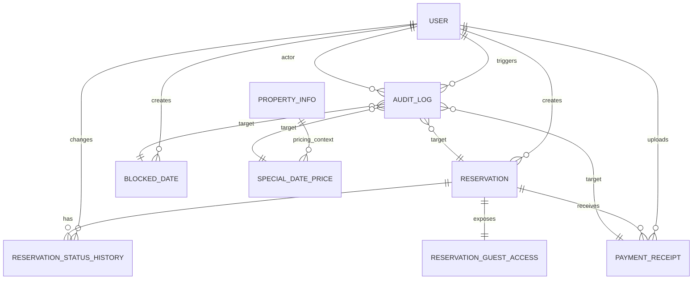

# Modelo de datos

## Objetivo

El modelo de datos inicial del sistema busca cubrir el flujo operativo base de una sola parcela recreativa:

- identificar usuarios clientes y administradores;
- registrar solicitudes de reserva con rango de fechas;
- bloquear fechas no reservables;
- definir precios especiales por rango;
- adjuntar comprobantes de pago;
- conservar trazabilidad de cambios de estado y eventos relevantes.

## Principios del modelo

1. Cada concepto de negocio vive en una entidad propia y no se mezcla con tablas comodin.
2. Las reservas guardan su estado actual y su historial por separado.
3. La disponibilidad no depende de un calendario precalculado; se resuelve a partir de reservas activas y bloqueos.
4. Los precios especiales se modelan aparte de la reserva para evitar acoplar pricing operativo con pricing historico.
5. La trazabilidad queda preparada desde la base con historial de estado y `AuditLog`.

## Entidades implementadas

### `users.User`

Actor autenticado del sistema.

Responsabilidades actuales:

- autenticacion por email;
- rol `admin` o `client`;
- datos personales basicos.

### `properties.PropertyInfo`

Perfil publico activo de la parcela.

Responsabilidades:

- exponer informacion general publica;
- definir capacidad maxima;
- proveer tarifa base diaria para cotizaciones;
- centralizar datos publicos de contacto y operacion.

### `reservations.Reservation`

Agregado principal del negocio.

Responsabilidades:

- representar la solicitud o reserva sobre un rango de fechas;
- mantener el estado actual;
- conservar el monto cotizado acordado con el cliente;
- centralizar notas visibles para operacion.

Campos principales:

- `customer`
- `start_date`
- `end_date`
- `guest_count`
- `status`
- `quoted_total_amount`
- `currency`
- `customer_message`
- `internal_notes`
- `status_reason`
- `expires_at`
- `status_updated_at`

`status_updated_at` representa la ultima actualizacion explicita del estado, no cualquier edicion general del registro.

### `reservations.ReservationStatusHistory`

Historial de transiciones de estado de una reserva.

Responsabilidades:

- registrar `from_status` y `to_status`;
- guardar comentario operativo;
- identificar quien ejecuto el cambio;
- servir como base para timeline administrativo y auditoria de negocio.

### `reservations.ReservationGuestAccess`

Canal de acceso publico por reserva para la V1.

Responsabilidades:

- guardar snapshot de contacto usado al crear la solicitud publica;
- almacenar el hash del token de seguimiento de la reserva;
- permitir consulta de estado y carga de comprobantes sin obligar login;
- registrar la ultima vez que ese acceso fue utilizado.

### `availability.BlockedDate`

Rangos de fechas manualmente no disponibles.

Responsabilidades:

- bloquear la parcela por mantenimiento, uso interno u otra causa;
- distinguir bloqueos activos e inactivos;
- registrar razon y creador del bloqueo.

### `pricing.SpecialDatePrice`

Sobrescritura de precio para un rango de fechas.

Responsabilidades:

- definir un `daily_price` especial;
- evitar solapamientos activos que creen ambiguedad comercial;
- permitir activacion o desactivacion sin borrar historial.

### `payments.PaymentReceipt`

Comprobante de pago subido para una reserva.

Responsabilidades:

- almacenar archivo del comprobante;
- registrar monto y referencia declarada por el cliente;
- permitir revision manual administrativa;
- conservar notas de revision.

Regla de integridad actual:

- si el comprobante esta `pending_review`, `reviewed_by` y `reviewed_at` deben ser nulos;
- si el comprobante esta `approved` o `rejected`, ambos campos deben existir.

### `audit.AuditLog`

Registro generico de eventos de auditoria.

Responsabilidades:

- asociar eventos a cualquier entidad del sistema;
- guardar actor, accion, resumen y cambios estructurados;
- preparar trazabilidad transversal sin acoplarla a una sola app.

## Relaciones principales

## Disponibilidad

La disponibilidad no se persiste como una tabla separada.

Se calcula a partir de dos fuentes:

- `Reservation` en estados que bloquean disponibilidad;
- `BlockedDate` activos.

### Estados que hoy bloquean disponibilidad

- `pending`
- `observed`
- `awaiting_payment`
- `payment_submitted`
- `confirmed`

La razon es operacional: mientras una solicitud esta viva, el sistema asume que retiene el rango y evita doble asignacion prematura.

## Prevencion de sobre-reserva

La base ya incorpora una restriccion PostgreSQL de exclusion en `Reservation`:

- no permite dos reservas activas con rangos de fechas solapados.

Esto deja una proteccion real a nivel de base de datos y no solo a nivel de UI o serializer.

### Estrategia recomendada de aplicacion

Al crear o aprobar reservas, la capa de servicio debe:

1. abrir transaccion;
2. consultar bloqueos activos y reservas activas solapadas;
3. crear o actualizar la reserva;
4. manejar error de constraint como conflicto de disponibilidad.

## Validacion de estados

El estado actual vive en `Reservation.status`.

La validacion de flujo queda modelada en `ReservationStatus.ALLOWED_TRANSITIONS`.

Transiciones base:

- `pending` -> `observed`, `awaiting_payment`, `rejected`, `cancelled`, `expired`
- `observed` -> `awaiting_payment`, `rejected`, `cancelled`, `expired`
- `awaiting_payment` -> `payment_submitted`, `cancelled`, `expired`
- `payment_submitted` -> `observed`, `confirmed`, `rejected`
- `confirmed` -> `cancelled`

La app ya tiene una base tecnica para que futuras acciones API usen reglas consistentes y dejen rastro en `ReservationStatusHistory`.

Ademas, `ReservationStatusHistory` valida que una transicion registrada sea compatible con el workflow definido.

## Decisiones de modelado

### Estado como enum, no tabla configurable

Se usa un conjunto de estados en codigo porque:

- el workflow es parte del dominio, no solo catalogo editable;
- permite validar transiciones sin depender de datos mutables;
- simplifica permisos, queries e integridad.

### Historial separado del estado actual

La reserva mantiene lectura rapida del estado actual y el historial se conserva en otra tabla para timeline y auditoria.

### Acceso invitado separado de la reserva base

`ReservationGuestAccess` vive aparte porque no toda reserva necesitara un canal publico en el largo plazo.

Esto permite:

- mantener `Reservation` enfocada en negocio principal;
- conservar token hasheado y snapshot de contacto sin contaminar el agregado base;
- soportar en paralelo flujo publico y flujo autenticado.

### Precio especial separado de la reserva

`SpecialDatePrice` define reglas operativas.
`Reservation.quoted_total_amount` conserva el valor negociado o calculado para la reserva concreta.
`PropertyInfo.base_daily_price` cubre el precio base cuando no existe una tarifa especial aplicable.

Esto evita que un cambio posterior de pricing altere la interpretacion historica de una reserva ya creada.

### Comprobante como entidad propia

Se modela aparte porque una reserva puede requerir mas de un comprobante o reenvio durante la revision.

## Que queda listo para la API y la logica de negocio

Con este modelo ya existe una base solida para construir:

- informacion publica real de la parcela;
- consulta de disponibilidad por rango;
- creacion de solicitud de reserva;
- seguimiento publico de reserva mediante token;
- timeline de estado de la reserva;
- subida y revision de comprobantes;
- panel administrativo de bloqueos y precios especiales;
- auditoria transversal basada en eventos.

La siguiente fase debe profundizar esta base con mas operaciones API, permisos por caso de uso, servicios transaccionales mas ricos y validaciones operativas complementarias.

## Validacion pendiente en PostgreSQL real

La forma del modelo y las migraciones ya esta preparada para PostgreSQL, incluyendo exclusion constraints sobre rangos de fechas.

Lo que falta confirmar en entorno real es:

- aplicar `migrate` contra PostgreSQL levantado localmente;
- verificar la creacion efectiva de las exclusion constraints;
- probar inserciones que confirmen rechazo de solapes en `Reservation` y `SpecialDatePrice`;
- confirmar que el manejo de errores de integridad se traduce bien a conflictos de negocio en la futura capa API.
